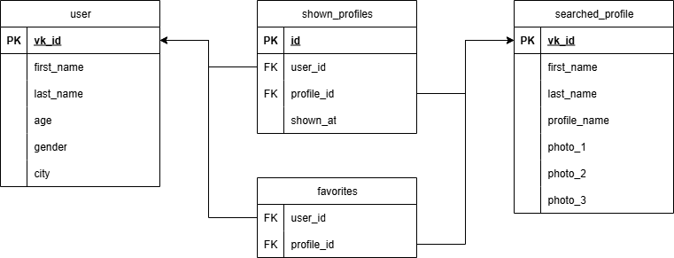

> # **VKinder**

Программа-бот для взаимодействия с базами данных социальной сети. Бот предлагает различные варианты людей для знакомств в социальной сети ВКонтакте в виде диалога с пользователем.

> ## 📁 Структура проекта
>
> ```Py
> .../VKinder/
> │
> ├── main.py               # Главный файл для запуска бота
> ├── config.py             # Файл для конфигурационных данных (токены, настройки БД)
> ├── .env                  # Переменные окружения (скрытые)
> |
> └── bot/                  # Пакет для логики бота
>    ├── __init__.py
>    ├── bot_core.py        # Ядро бота: обработка входящих сообщений, FSM
>    ├── keyboard_utils.py  # Функции для создания клавиатур (кнопки "Вперед", "В избранное")
>    └── message_handlers.py # Обработчики конкретных команд и сообщений
> │
> └── database/              # Пакет для работы с базой данных
>    ├── __init__.py
>    ├── db_creator.py       # Скрипт для создания БД и таблиц
>    ├── db_models.py        # Описание моделей (таблиц) БД (используем ORM, например, SQLAlchemy)
>    └── db_func.py          # Функции для работы с БД (добавление, извлечение данных)
> │
> └── vk_tools/              # Пакет для работы с VK API
>    ├── __init__.py
>    ├── vk_api_func.py      # Основные функции для запросов к VK API (поиск людей, фото и т.д.)
>    └── vk_tools.py         # Вспомогательные инструменты (парсинг ответов, обработка ошибок)
> │
> └── tests/                  # Пакет с тестами
>    ├── __init__.py
>    ├── test_database.py     # Тесты базы данных
>    ├── test_search.py       # Тесты функций поиска
>    └── test_vk_api.py       # Тесты получения информации о пользователе
> │
> └── utils/                  # Пакет для утилит
>    ├── __init__.py
>    └── common_func.py       # Общие вспомогательные функции
> │
> └── docs/                   # Папка для документации
>    ├── __init__.py
>    └── README.md            # Инструкция по установке и использованию
> |
> ├── vkinder_db.png          # Схема базы данных
> └── requirements.txt        # Список зависимостей (библиотек)
> ```

### Структура базы данных:

База данных состоит из следующих таблиц:

    • users - хранит информацию о пользователях (vk_id, имя, фамилия, возраст, пол, город);
    • searched_profiles - модель найденного профиля (кандидата) (vk_id, имя, фамилия, ссылка на профиль);
    • shown_profiles - вспомогательная таблица для учета показанных анкет;
    • favorites - Вспомогательная таблица для связи "многие-ко-многим" между User и Profile



### Основные функции:

    • Поиск кандидатов (других пользователей ВК) для знакомств, используя информацию (возраст, пол, город) о пользователе, который общается с ботом в ВК.

    • Получение 3 самых популярных фотографий в профиле кандидата. Популярность определяется по количеству лайков.

    • Вывод в чат информации о пользователе.

    • Реализовано меню '➡️ Дальше', '🔄 Начать заново' и '📋 Главное меню'.

    • Реализованы кнопки '❤️ В избранное' и '⭐ Мое избранное'
